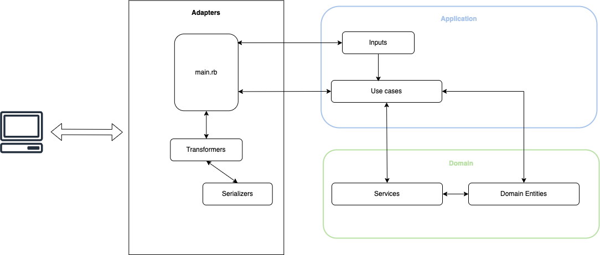

# FCM Digital - Ruby Technical challenge

## Table of contents
- [Description](#description)
- [Code architecture](#code-architecture)
  * [Domain entities](#domain-entities)
  * [Services](#services)
  * [Use cases](#use-cases)
  * [Inputs](#inputs)
  * [Errors](#errors)
  * [Serializers](#serializers)
  * [Transformers](#transformers)
  * [Tests](#tests)
- [Potential improvements](#potential-improvements)
- [Project: Getting started](#project-getting-started)
  * [Technologies](#technologies)
  * [How to build the project](#how-to-build-the-project)
  * [How to run the script](#how-to-run-the-script)
  * [How to run the test suite](#how-to-run-the-test-suite)

---

## Description

Within the file [CHALLENGE-EXPLANATION](CHALLENGE-EXPLANATION.md) we can find the requirements for the **FCM Digital - Ruby Technical challenge**.

---

## Decision making

This solution is built over a Rails API application (although it's not necessary). In addition, we use Docker with a couple of containers: one for the database and one for the backend application.

Finally, we include a script in the root of the project (`main.rb`) to be able to run the command just as was said in the challenge explanation. We can find furhter details about its execution in the section [How to run the script](#how-to-run-the-script).

These are the main decisions that were made during the implementation:
- Logic to get the segments:
  To get the segments from the input file, we use some Regular expressions (REGEX). This allows to extract the data in a structured way and compound our domain entities to start working with them.

- Logic to sort the segments:
  Reading the segments, we have set a consistent beginning date for every segment in order to achieve an ordering that makes sense. For instance, when the segment is an `Hotel`, we set the beginning timestamp to end of day because we think if, there is another segment of transport (`Flight`, `Train`, ...), this one will happen before than the `Hotel` segment in the same day.
  Therefore, we use this `beginning date` to sort the segments in chronological order.

- Logic to group the segments:
  Once we have the segments in chronological order, we need to group them based on the trip destination.
  To do that, we decide to get sub-arrays. For instance, if the destination city of a segment is the base city of the user, we can mark the trip as completed and move on with the following one.
  Instead of spliting the list of segments into sub-arrays manually, we use the method [chunk_while](https://ruby-doc.org/core-3.1.0/Enumerable.html#method-i-chunk_while) from the `Enumerable` module.

- Logic to print the segments:
  To print the segments in the requested format, we decide to use [Internationalization (I18n)](https://guides.rubyonrails.org/i18n.html). This will help in the future in case that we support different languages.
  For instance, if we want to return the output in a different language at some point, we just need to add the translations on this language and set the locale we wish, and our code will keep working fine.

The way to structure and implement the logic for this solucion will be shown in the next section of [Code architecture](#code-architecture)

---

## Code architecture

In this section we want to explain the code architecture that was implemented. Mainly, this architecture is based on the following:
- SOLID principles
- Hexagonal architecture
- Domain-driven design (DDD)
- Dependency injection.
- Test driven development (TDD)

Taking into account the mentioned points, our solution is divided into several layers, following the principles of clean architecture to build better software reducing coupling and dependencies. With this, we achieve our code is reusable, and easy to read, to maintain and to extend.

Also, the code is completely tested using Unit Tests as minimum.

Therefore, we have the following layers in our application:
- Adapters:
  - The main script
- Application
  - Use cases
  - Inputs for each use case
  - Transformers and serializers
- Domain
  - Entities
  - Services

  <p align="center">
    
  </p>

Having said that, we have different types of code pieces:

### Domain entities
We have the following entities:
- `SegmentEntity`:
  It represents a segment in the trip, such as a hotel, a flight, a train, etc.
- `TripEntity`:
  It represents a trip and is composed of several segments.

### Services
In this case, we can understand a service like a piece of code that perform a single action.
We have the following services:
- `InputParser`
  - `ExtractSegmentDataService`:
    Given a text line, it extract the data for a segment.
  - `GetSegmentsFromInputService`:
    Given a file, it returns the list of segments included in the file.
  - `OrderSegmentsService`:
    Given a list of segments, it sorts them in chronological order.
- `Segments`
  - `GroupSegmentsPerTripService`:
    Given a list of segments, it groups them per trip.
- `Trips`
  - `CalculateDestinactionCity`:
    Given a list of segments, it calculates the destination city of a trip.
  - `CalculateStartDate`:
    Given a list of segments, it calculates the start date of a trip.

### Use cases
In this solution, we can understand an use case like a services orchestrator.
We have the following use cases:
- `GetItineraryUseCase`: It takes care of calling the different services that we need to complete the use case.

### Inputs
The inputs contains the parameters that use cases need:
- `GetItineraryInput`: It contains the base place and the filename where we find the reservations of our user.

### Errors
We implement our custom errors, based on the `StandardError` class:
- `InvalidInputError`: It is raised if some of the required arguments in the input is missing.
- `FileNotFoundError`: It is raised if the input file does not exist.

### Serializers
Our serializers take care of, given a domain entity, return the response in the appropiate format, based on the challenge requirements.
We have the following serializers:
- `SegmentSerializer`:
  Given a `SegmentEntity`, it returns the expected response for the segment.
- `TripSerializer`:
  Given a `TripEntity`, it returns the expected response for the trip (including its segments).

### Transformers
Similar to serializers, the transformers take care of building the final output of the system, based on the challenge requirements as well.
We have the following transformers:
- `ItineraryPlainTextTransformer`:
  Given a list of trips (`TripEntity`), it returns the final response in the expected format (in this case, using plain text and taking into account the line breaks).

### Tests
We implement unit tests for each piece of code. As we are using the framework RSpec, you can find the tests in the `spec/` folder.

The idea for any unit test in this project is to test only what we need inside a piece of code. Because of that, we perform a mock the calls to external code pieces.
In addition, leveraging the use of dependency injection, we can inject fake classes in the initialization of the code piece we are testing, avoiding the call to the real external class.

---

## Potential improvements
In this section, we can find some improvements for our solution:

- **Data persistence:**

  Assuming that we might receive the input text via webhook or having a periodical process that pulls the data, we might persist the information in a database.

  For example, we might have the following data model:

  <p align="center">
    
  </p>

  Once we have the information in a database, we might query the itinerary for a certain user and return it somehow, for example, exposing it in an API endpoint.

- **Parameters validation:**

  We decide to implement our own validation for the input arguments, due to the validation in this case was very simple. However, we can use some library/gem to include this arguments validation. For example, we might use the gem [dry-validation](https://github.com/dry-rb/dry-validation) and implement some contracts. We can find further details [in their documentation](https://dry-rb.org/gems/dry-validation/1.10/).

---

## Project: Getting started

### Technologies
* [Ruby](https://www.ruby-lang.org/en/) (Version: `3.3.1`)
* [Ruby on Rails](https://rubyonrails.org/) (Version: `7.1.3.2`)
* [Rspec](https://github.com/rspec/rspec-rails) (Version: `6.1.2`)
* [PostgreSQL](https://www.postgresql.org/)
* [Docker](https://www.docker.com/)

### How to build the project
As we are using Docker, we need to build the containers as a first step:
```bash
docker-compose build
```

It is not the case, but if we want to start the Rails application, we need to start the containers through the following command:
```bash
docker-compose up -d
```

In the same way, we can use the following command to stop the containers and, therefore, our application
```bash
docker-compose stop
```

On the other side, the first time we are using this project, we will need to create the database (Although I know that the database has not been used to solve this challenge):
```bash
docker-compose run --rm backend-app sh -c "bundle exec rails db:create"
```

### How to run the script
As we are using Docker in our app, we will need to run the script `main.rb` through the following command:
```bash
docker-compose run --rm backend-app sh -c "BASED=SVQ bundle exec ruby main.rb input.txt"
```

### How to run the test suite
As we use Rspec for testing, we can run the whole test suite through the following command:
```bash
docker-compose run --rm backend-app sh -c "RAILS_ENV=test bundle exec rspec ./spec/"
```
